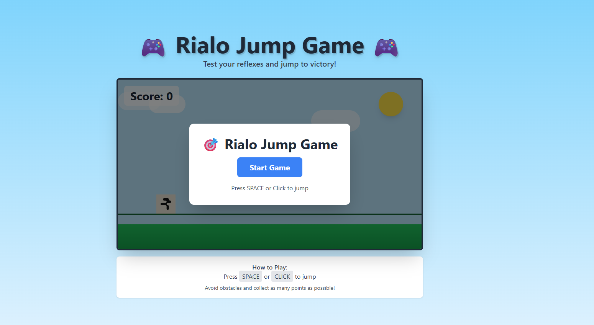

#  Rialo Jump Game

A fun and addictive endless runner jump game built with React! Test your reflexes and see how high you can score!

##  Play Now

**[ Play Rialo Jump Game Here](https://tiramitsueth.github.io/rialo-game/)**

---

## 📖 About

Rialo Jump Game is a simple yet challenging browser-based game where you control a character that must jump over obstacles. The game gets progressively harder as your score increases!

##  Features

-  Beautiful sky-themed graphics
-  Simple one-button gameplay
-  Score tracking system
-  Endless gameplay
-  Responsive design
-  Keyboard and mouse support

##  How to Play

### Controls
- Press **SPACE** bar to jump
- Or **CLICK** anywhere on the game screen to jump

### Objective
- Avoid the red obstacles (cacti) 🌵
- Jump over them to earn points
- Try to beat your high score!
- The game ends when you hit an obstacle

### Tips
-  Timing is everything - don't jump too early or too late
-  Keep your eyes on the incoming obstacles
-  Stay focused as the game speeds up
-  Practice makes perfect!

---

**Happy Gaming! **
